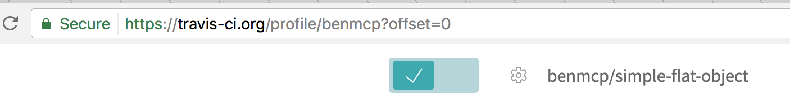
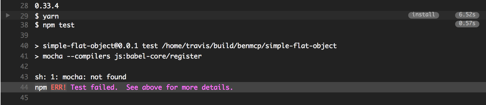

# Simple Travis CI

This is a simple explanation of how to use Travis CI for a [simple package](https://github.com/benmcp/simple-flat-object).

Login into TravisCI and register [your account](https://travis-ci.org/).

Add a public repo and activate it:



Turn on `Build only if .travis.yml is present`

Add a `.travis.yml` file to your repo base:
```
language: node_js
node_js:
  - "stable"
```

On github in `Integration and Settings` click `Test service`:


If you then go to `Tavis-ci` to view your test results, you may notice an error such as this:



Also note, though we only had `mocha` installed locally, `Tavis CI` will look for a `.bin/` executable of `mocha`, namely:

```
./node_modules/.bin/mocha
```

## Setting ths up with Slack

It is all good and well that we have Travis CI checking our code, but we want to know when this fails.

The best way to do this is to integrate it with `Slack`.

Click the following link to [instal Travis CI](https://slack.com/apps/A0F81FP4N-travis-ci) to your slack workspace.

You will then be prompted with a simple addtion to your `.travis.yml` file which will send notifications to slack:

```
 notifications:
    slack: workspace:XXXXXXXXX
```

Then, then you complete a git push, you will receive a notification from `Travis CI` in your allocated `Slack Channel` that all tests have been passed or failed:

[!alt](../.images/travis-ci-pass.png)
