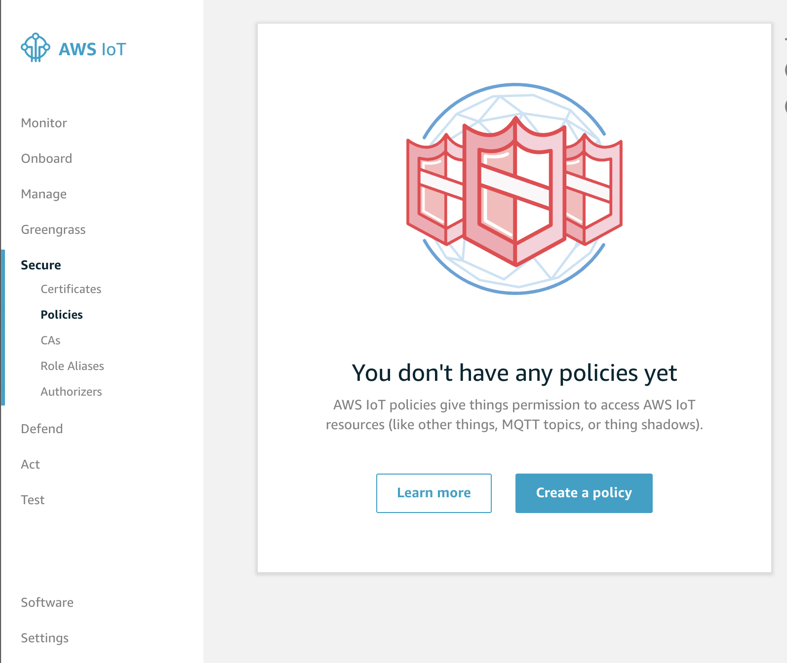

# Getting Started

## Create an IoT Thing.

1. Log into [AWS IoT Core](https://console.aws.amazon.com/iot/home?region=us-east-1#/learnHub) and click `Manage`.

2. Then click `Create a thing`, then `Create a single thing` to create a single thing!

3. Give your thing a Name, Type and Group then click next:

4. Then, we will need to create a certificate that we can use to validate that we own that thing. Click `Create Certificate` for `One-click certificate creation (recommended)`.

5. When you certificate is created, go ahead and download the three separate tickets, the IoT Certificate and the public/private certificates:

6. You will also need to download the root CA for AWS IoT, so go head and click on `Download` and download the `RSA 2048 bit key: Amazon Root CA 1.` file

7. Then click `Activate`

8. Next click `Attached a policy` and then click `Register Thing`

9. Now that this is done, you will need to register a policy with this `Thing`. To do this you can go to `Secure > Policies` and click `Create a Policy`:

10. Then create a very simple policy, this one will have a very open set of possible actions, namely `iot:*` and can be applied to a also very open range of `topics`. This is not advised but is great to do for simple proof-of-concept testing. The same can be said for `Resource ARN` which we will be setting as `*`. For the effects, click `Allow`. This is basically a normal IAM Policy.

11. Once this has been created, go to `Secure > Certificates` and attach this policy to the certificate as shown below:

Now you have the following:

- A Thing (`sample-sat`) has been created and has had it certificates created
- A Policy (`simple-sat-policy`) has been craeted and attached to the certificate

12. Next, let's create a sample topic and push a payload to it. Go to `Test` and create the sample topic `sample-sat-feed/1` and click `Publish to topic`. We will come back to this later.

## Set up a pretend IoT

TODO
